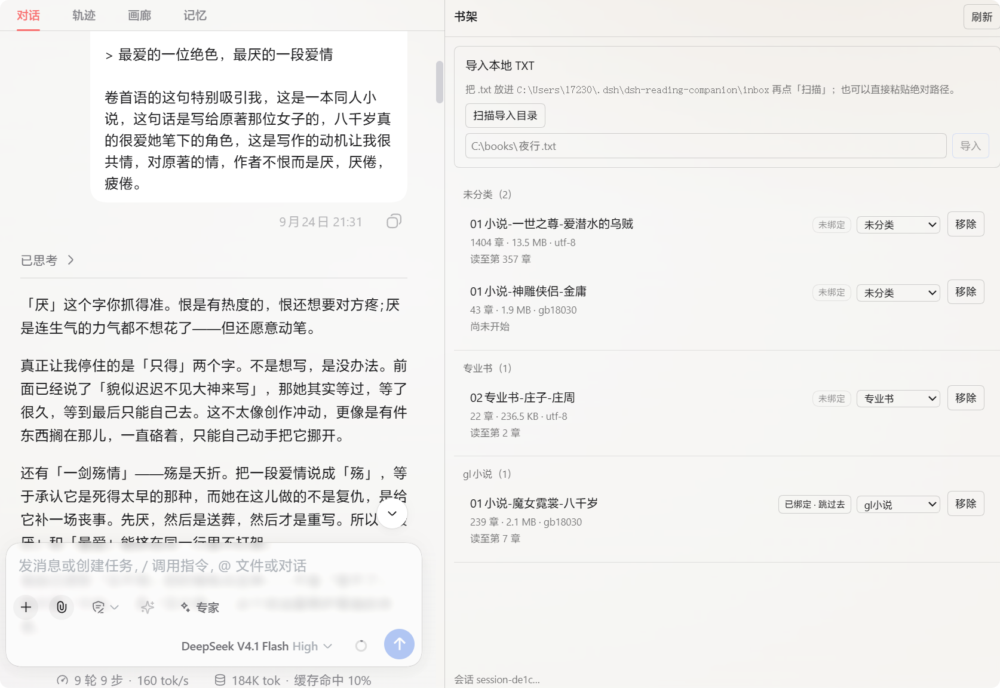

# dsh-reading-companion

[](./LICENSE)
[](https://github.com/topics/dsh-plugin)
[](https://github.com/deepseek-ai/deepseek-harness)

**AI 陪伴 + 精读小说 —— Novel companion。** 这是 DeepSeek Harness（DSH）的本地 TXT 阅读器 + **不剧透的 AI 陪读**插件：把一本书装进右侧栏，让「读」和「聊」在同一屏发生 —— 你在正文里划一段、写下想法，它接着聊；而它**只读到你读到的地方**。

- **读什么**：本地 **TXT**（自动探测编码、自动切章；无标题时降级为固定块），原书、笔记、AI 的理解**全在你自己磁盘上** —— 无账号、无云、无书源
- **怎么陪**：陪读 AI 的视野 = **本章全文** + **上一章结尾** + 随进度**增量补齐**的「背景认识」，**不含你未读的部分**（想看它到底收到了什么，见下面「防剧透」那节）
- **留下什么**：摘抄 → 我的感想 → AI 回应，写成结构化 Markdown 笔记，可直接导出进 Obsidian 之类的笔记库
- **怎么装**：DSH 插件（Cordis bundle），**零运行时依赖、零构建步骤** —— `lib/` 就是源码

<h3 align="center">本地 TXT → 自动目录 → 正文阅读 → 进度持久化 → 绑定会话陪读<br>
→ 三层防剧透 → 摘抄笔记 + 自动 tag → 背景认识增量补齐 → 导出到笔记库</h3>

<p align="center">
  
</p>

[功能总览](#功能总览) · [怎么用](#怎么用) · [防剧透](#防剧透三层) · [安装](#安装) · [配置参考](#配置参考) · [数据目录](#数据目录) · [开发](#开发)

> **每个版本改了什么、为什么改** → 见 [**Releases**](https://github.com/xling001/dsh-reading-companion/releases)（只写读者能感知的结论）；每一轮的设计取舍与踩坑记在 [`docs/design.md`](./docs/design.md) 的修订块里。
> **这份 README 只讲它现在是什么、能做什么、怎么用** —— 更新说明不再放在这里。

---

## 功能总览

| 能力 | 说明 | 入口 |
|---|---|---|
| **本地阅读** | 导入本地 TXT（BOM → 严格 UTF-8 → GB18030 依次探测；按标题正则切章，无标题时降级为固定块并给出解析告警）。目录、正文、上一章/下一章、字体（字号 / 行距 / 字体族）；阅读进度按书持久化。**目录按卷分组并折叠**（只展开当前卷、筛选时全开，卷标题带起止章号与章数）——1400 章的书不必一次铺出七千个元素 | 书架 / 正文页 |
| **读者坐标** | 全插件只有**一个坐标**：你读到第几章。投喂窗口、记忆缺口、跳读闸、倒退过滤、讨论注入全部由它派生——所以它绝不会"顺手"知道更多 | — |
| **不剧透陪读** | 三层：**提示词守则**（常驻，不受开关影响）+ **路径闸**（硬拒绝指向本书 `content.txt` / `source.txt` / `chapters.json` 的调用，**与会话归属无关**，`../` 绕过也挡）+ **联网闸**（默认 `block-all`；`block-book` 是启发式，明说挡不住刻意查询）。注入内容可用只读接口 `GET …/books/<bookId>/context` 逐字复核 | 设置页 |
| **摘抄笔记** | 正文里**选中一段**即弹出「记笔记」，带这段原文与该章节号进入四段式：**原文摘抄** / **我的感想** / **tag**（按关键词确定性打分，**零模型调用**）/ **AI 回应**（留空则不落盘）。正文页还会显示「**本章你记过 N 条**」——点开是**每条一行摘要**（感想前 30 字）与「**跳到这一段**」，点它回到原文那一段（没选中原文的显示「整章」）；**长文不在正文里铺开**，回笔记页读（那里可「展开全文」）。笔记列表**分页浏览**（每页 10 条、可往回翻），每条可**一键跳回对应章节** | 正文页 / 笔记页 |
| **背景认识（记忆）** | 随进度**增量补齐**的 `background.md`：**九节** —— 开头一节**元判断**「**文本类型**」（200 字以内：什么方向、讲的是谁的故事、人称与视角、有没有第二位主角，再给各条目一点大概方向；第一次补齐时写，之后每批都带着它）+ 「**人物状态**」（3.0：一位一句"现在进行时"，只记活跃窗口内的人，每批**替换**旧的进「已取代」）+ 给 AI 的五分区（人物关系 / 人物 / 世界观 / **文风（只写一次）** / 通用概念）+ **只给你看、不进提示词**的「**时间与分线**」（主线骨架 + **无归属人的大事** + 单元 + ⭐ 影响 ——⭐ 3.0 起原「前文脉络」并进了这里）与「**冷档案**」（3.0：被移出上下文的旧条目，原文只搬运不删除）+ `### 主体` 分组 + **每条带章号** + **只增不减**。缺口超过阈值时**先问再补**，发笔记那一路自动打底**开头 30 章**；落窗前的归档（零模型调用）、超预算时的**分节压缩**（一次只重写一节）过**五条硬校验**，备份三件套（陪读文件夹历代备份 / `background.history` 增量 / 导出文件夹「自动备份」全文快照） | 设置页 / `background.md` |
| **人物卡** | 「只含你读到部分」的按人只读视图，标注最新章号。**判定就是分区归属**：只有 `## 人物` 里的主体出卡，改文件即可增删。**建卡门槛**（要紧）：他得有**"自己的线"**、并且写得出**只关于他自己**的一条 —— 只被提到过的次要角色写在主角名下即可，等他有了自己的戏再补卡。列表按 **关系多 → 最近说到** 排序，**主要人物排最前** | 设置页 |
| **导出** | 笔记**增量追加**（不覆盖你在笔记库写的批注与双链）、背景**整份快照**、「压缩前」**一代一个文件**；文件名自带书名、每本书一个文件夹；拒绝写进没有标记的陌生文件。**导出结果常驻在那一节里**（成功绿 / 失败红 + 上次导出时间） | 设置页 |
| **书友设定 / 讨论历史** | `persona.md` 管口吻与关注点（与守则一起生效，**不覆盖**硬底线）；讨论时间线保存在书目录里，可回顾 | 设置页 |

---

## 怎么用

四个地方，各管一件事。

### ① 书架：导入、绑定、分类

把 TXT 丢进 `$DSH_HOME/dsh-reading-companion/inbox/` 点「**扫描导入目录**」，或直接粘一个绝对路径。
每本书显示章数、体积、编码与阅读进度；点「**跳过去**」进正文，也可以先选个分类、绑定一个会话。

### ② 正文：选中一段，点「记笔记」

顶部是上一章 / 下一章 / 设置 / 笔记 / 字体（Aa）。在正文里**选中一段**，浮动条会自动弹出
「已选 N 字」与「记笔记」——点它会带着**这段原文与该章节号**进入笔记页。

### ③ 笔记页：摘抄 → 感想 → AI 回应

四段式：**原文摘抄**（自动填）、**我的感想**、**tag**（按感想里的词确定性打分，可自己加）、
**AI 回应**（可选，留空就不落盘）。按钮分两行：`① 发到会话去聊` / `② 抓取选中文字作回应`，
然后是落盘用的「**写入笔记**」（主按钮）与暂存用的「**保存草稿**」；**导出在「设置」页**
（那一页还能记住导出目录）。换笔记存放位置也在这一页。

<p align="center">
  
</p>

### ④ 设置（「本地书架」页）：绑定、人设、记忆

右侧栏「+」里选「**本地书架**」：绑定会话、写「**书友设定**」（你想要的口吻与关注点）、
看**背景认识**记住到第几章、翻**人物卡**（只含你读到的部分），
以及这本书的**讨论时间线**。

<p align="center">
  
</p>

---

## 防剧透：三层

| 层 | 强度 | 管什么 |
|---|---|---|
| **提示词守则** | 常驻，不受任何开关影响 | 不主动说后续 ——**包括"制造期待"式的元剧透**（"后面有反转"、"熬过这段就好"、"以后看到 X 留意"、"我先不说"）；引文只能来自原文（不许凭记忆引，那可能把**后文**引出来）；分清事实 / 引语 / 推断；用了二手来源（书评 / 百科 / 它自己的记忆）就**第一句声明**，且**读者永远优先于二手来源** |
| **路径闸**（`spoilerGate`） | **硬保证**（唯一例外见下） | 参数指向本书 `content.txt` / `source.txt` / `chapters.json` 的调用一律拒绝，**与会话归属无关**。⚠️ **唯一例外**：你在面板里声明「这本书已读完」之后，**这一本**的原始文本对你放开（界面常驻显示，可一键收回） |
| **联网闸**（`webGate`） | 启发式 / 可关 | 见下 |

它每轮实际拿到的只有三样：**本章全文**、**上一章结尾**、那份**背景认识**——外加你贴过去的摘抄。
**你还没读到的地方，它字面上拿不到**：路径闸连"模型自己想办法去读文件"这条路都堵了（`../` 之类的绕过也挡，有专测）。
⚠️ **但它是"路径闸"不是"文件闸"**：Windows 的 8.3 短名与硬链接能指向同一个文件而路径不同，**这两种仍能绕过**（见下方「安全与隐私」的边界表）。
**读完一本书之后**，你可以在面板里标记「已读完」解锁它：那只放开**这一本**的原文（"你问，它才读得到"），**不影响每轮自动投喂的内容**，而且可以一键收回。
想亲眼复核它到底收到了什么：注入的内容由插件的只读接口原样给出 ——
`GET /dsh-reading-companion/api/books/<bookId>/context`（面板里**不再**放这个入口，
因为它只是「别处状态的视图」，摆一节在那里会让人以为它可以单独重建）。

联网闸是**启发式**：扫工具参数里有没有书名、人物名、"结局/剧透"这类词，能挡住无心之失，
**挡不住刻意查询**——这一点写在守则里，也写在 [`docs/design.md`](./docs/design.md) 里，不装成"绝对防得住"。

## 导出到笔记库

在「设置」页点「导出背景与全部笔记」之后，**默认落到这本书所绑会话的工作区根**下的
`陪读导出_<书名>/`，文件名是 `<书名>-笔记.md`；在设置页里填过一次导出目录就落到那里
（还没绑定会话、又没填目录时它会让你先指定一个 —— 不会乱猜一个位置写进去）。

它就是普通的 Markdown：用**任何**笔记库工具打开、编辑、提交到版本管理都行。

**导出的结果不再弹提示框**：它常驻在这一节的说明里（**成功绿 / 失败红**），并记着**上次导出是什么时候**、
新建了几个、更新了几个 —— 它属于"这一节的状态"，看一眼就知道，不用去追一条会消失的提示。

- **只追加，绝不覆盖。** 你在笔记库里写的批注、加的双链，重复导出一个字都不会被碰。
- **绝不往陌生文件里写。** 每个导出文件头部有一条 `<!-- drc-export book=… -->` 标记；目标属于别的书、
  或者压根没有标记（那是你自己写的文件），一律拒绝并报错。
- **手写的、没有 id 的笔记块不导出**，并会明说几条。

## 背景认识（记忆）

> **同一人物被写成两个 `###` 时**，用工具合并：
> `node scripts/merge-background-subjects.mjs --file <background.md> --merge '<被并掉的名字>=<留下的名字>'`
> —— 默认只预览，加 `--apply` 才写，写前自动备份。**压缩不会替你合并**：它的「保主体」校验不许丢任何一个主体。

**它是陪读 AI 对这本书的理解**，一份随进度**只增不减**的 Markdown：

```markdown
## 文本类型        ← 元判断：像作者写一句自己的简介（200 字内）+ 各条目的大概方向
- 武侠小说，主线是感情线，第三人称限知；讲的是甲和第二主角乙的故事。侧重：人物卡少建，分线按关系阶段分单元。
## 人物关系      ← 一条写一对人、两个视角一次写全；只写关系（经历在「人物」里）
- 甲 ↔ 乙：同门 → 对手（`第3章` 起结怨）；`第8章` 一起拜入师门
## 人物          ← 一条说一件事（每条以章号开头、按时间排），一条 40 字内
### 甲
- `第2章` 借六岁女童之身重生，处境贫苦。
- `第29章` 潭边第一次无法再掩饰心意（`第31章` 立下要护住身边人的目标）。
## 世界观 / ## 文风（只写一次） / ## 通用概念（兜底）
## 时间与分线      ← 只给你看：不进提示词，AI 读不到
### 主线
- `第1-30章` 阶段名：一句话说清这一段是什么（阶段 = 一次大换场）。
- `第18-24章` 无归属人的大事（原「前文脉络」的职责，3.0 并入这里）。
### 【支线】单元名 · 第45-72章
- `第45章` 起：怎么开始的。 / `第61章` 转折：关键转折。 / `第72章` 收：怎么结束的。
- ⭐ 影响：留下了什么（得到或失去的东西 / 结下的关系 / 改变的立场 / 下一步指向哪里）。
（被新条目取代的旧说法会搬进末尾 `## 已取代`，保留但不再喂给 AI）
```

- 写入 `background.md`，你**可以直接打开读、也可以改**——AI 记错了，改一行就是纠正。
- **哪几节喂给 AI，哪几节不喂**（判据：**"这句话会不会让模型顺着说？"**）：
  · **喂**：**文本类型**（元判断）+ **人物状态**（一位一句"现在进行时"）+ 人物关系 / 人物 / 世界观 / **文风（只写一次）**（+ 非小说的通用概念兜底）；
  ⚠️ 「**文本类型**」是**开头那节元判断**：第一次补齐时让 AI 像写一句**自己的简介**那样 ——
  什么方向、讲的是谁的故事，再加一句这类文本该**往哪边侧重**。它**写一次，但之后每一批补齐都会带着它**
  （这是它与「文风」的区别）；你也可以直接改它（改一句就换了方向）；
  ⚠️ 「**人物关系**」**一条写一对人、两个视角一次写全**（`甲 ↔ 乙：同门 → 对手（`第3章`）`），
  同一对人**按阶段可以多条**；**只写关系，不写经历**（经历在「人物」里）。两者的分工判据是
  「**把主语换成别人，这条还成立吗？**」—— 换成"他与某人的关系"还成立 ⇒ 那是关系，只写在关系里；
  ⚠️ 「**人物**」是**一条说一件事**（每条以 `` `第N章` `` 开头、按时间排，一条 40 字内）；有新信息就**追加一条**；
  ⚠️ **立卡门槛**：① 有没有**只关于他自己**的事实 ② 够**两条**吗 —— 两条都过才开 `###`；
  过不去的把名字与事实写在关系条目里，等他攒够两条再立卡。
  ⚠️ 「**文风（只写一次）**」只在**第一次补齐**时写一次 —— 行文风格不随剧情变，一次提炼就够；
  名字里的"只写一次"就是这件事（你随时可以打开 `background.md` 自己补改它）；
  · **不喂**：**时间与分线**（它常常写着"这里像埋了伏笔"，喂进去等于给提示 ✗）与归档区 `已取代`。
  所以「时间与分线」**只会出现在文件与导出里** —— 它是留着给你自己复盘、学结构用的。
- **「时间与分线」写成"树枝"，不是流水账**：**主线**只写骨架（每条一个阶段 = 一次大换场），
  **每个单元**（一个副本 / 一段关系 / 一段旅程）只写"怎么进来的 / 关键转折 / 怎么出去的"，
  最后一条**必须是 `⭐ 影响`** —— 它对后面留下了什么。**"这件事讲完了"就收一个单元**，
  同一件事跨几十章也还是一个单元（打包说完，不按章摊平）。
- 面板里另有一份**只读视图**「**人物**」卡：只含你读到的部分，按主体归堆、标注最新章号。
  **它的判定就是分区**：只有 `## 人物` 一节里的主体出卡。想让某个名字进出这张列表，改 `background.md` 的归属即可。
  **建卡门槛**：他得有"自己的线"（有关系网 / 有自己的经历与动机），并且写得出**只关于他自己**的一条；
  只是被提到过的次要角色写在主角名下就行 —— **等他有了自己的戏再建卡**（"现在不建"不等于"永远不建"）。
- 缺口大时**不硬补**：从目录跳到很靠后的一章（缺口超过阈值）会先拦一下，让你选
  「这些我都读过 / 只记最近这一段 / 先不补」——把没读到的章节写进记忆是**不可逆**的。
  而发笔记那一路**不会空手而归**：它会自动把**开头 30 章**跑完，再告诉你去面板补剩下的。
- **压缩是唯一会删内容的一步**，所以要过五条硬校验（保名 / 保主体 / 保号 / 真的变小 / 读者族条目不许少），
  任何一条不过就**整批丢弃、文件一字不动**；每次压缩前还会留**一代带时间戳的备份，一份不删**，
  导出时一代不漏地跟出去。

> **想要"最完整的那一版"：把历代并起来。** 每一代都是**完整快照**（不是增量），压缩只做删除与合并，
> 所以**越早的那一代覆盖的章更少、但每条更细**——"历代 + 当前"的**并集**才是最详细的那份。
> 但压缩后的条目没有 id、没有稳定标题，章号区间也可能被改写，**"哪条对应哪条"无法可靠判定**，
> 所以**插件刻意不做自动合并**。推荐做法：读完之后，把陪读文件夹（或导出的那组
> `-背景-压缩前-<时间戳>.md`）**交给 AI 或别的工具**合并，**并且保留原文件**。可以直接用这段话：
>
> > 把这本书的这几份背景认识合并成一份最详细的版本。输入：`background.md`（最新，已压缩）
> > 与 `background.bak.*.md`（历代压缩前快照，越早的通常越详细）。规则：
> > ① 以**并集**为目标——任何一代里出现过的条目都要保留；
> > ② 同一主体下按**章号**对齐；同一章号有多个版本时**取更详细的那一条**；
> > ③ **不要发明**输入里没有的内容，也不要按你的小说知识补充；
> > ④ 两条冲突时**并存并标注**；
> > ⑤ 输出到**新文件**，**一个输入文件都不要改**；
> > ⑥ 最后列出：补回了多少条、多少条无法对应、哪些章号有冲突。

---

## 安装

> [!IMPORTANT]
> **前置：[dsh-better-sidebar](https://github.com/omdsh-dev/DSH-better-sidebar) ≥ `0.19.0`（本仓库在 `0.19.1` 上验证）。**
> 本插件**自己不画侧边栏**——它只是往别人提供的右侧栏里**注册一个页签**，那个接口（`sidebarRightTabs`）
> 由它发布。缺了它的表现很坑：右侧栏「+」里**看不到「本地书架」**，而控制台**没有任何报错**。

**前置要求**：DSH ≥ `0.1.5-rc.2`、Node ≥ `22.19`（`engines: ^22.19.0 || >=24.0.0`）。

### 一键装（推荐让 DSH 自己装）

把下面整段复制到 DSH 对话框里发出去，它会自己找 profile、**检查并补齐前置**、装好、核对 manifest：

```text
请帮我把 DSH 插件 dsh-reading-companion 装进我当前的 profile。

1. 先确定 profile 目录：我用的是 DSH Desktop，profile 名应该是 desktop；如果我的环境实际属于别的面，
   请告诉我正确的 profile 名再继续。目录 = $DSH_HOME/profiles/<profile 名>，$DSH_HOME 默认 ~/.dsh。
   确认该目录下确实有 package.json 和 cordis.yml。
2. 检查前置插件 dsh-better-sidebar（需要 >= 0.19.0）。先看 profile 的 package.json 里
   dependencies 与 dsh.profile.bundles 有没有它。没有就先装，并告诉我最终版本号：
   dsh plugin --profile <profile 名> add dsh-better-sidebar
   这一步不能跳过：本插件的界面完全依赖它发布的 sidebarRightTabs 服务，缺了它右侧栏不会出现
   「本地书架」，而且不会报任何错。
3. 装本插件：
   dsh plugin --profile <profile 名> add "github:xling001/dsh-reading-companion"
4. 装完核对 profile 的 package.json 这两处：dependencies 里有 "dsh-reading-companion"、
   dsh.profile.bundles 里有 "dsh-reading-companion"。缺哪条补哪条。
5. 最后告诉我需要重启 DSH Desktop，以及重启后怎么验证装好了。
```

<details>
<summary>或者：命令行 / 手工 / 本地开发</summary>

```bash
# 前置（没装过才需要）
dsh plugin --profile desktop add dsh-better-sidebar   # Web 换成 --profile web

# DSH Desktop / DSH Web
dsh plugin --profile desktop add "github:xling001/dsh-reading-companion"
dsh plugin --profile web     add "github:xling001/dsh-reading-companion"
```

| 你用的面 | profile 名 | profile 目录 |
| --- | --- | --- |
| **DSH Desktop** | `desktop` | `$DSH_HOME/profiles/desktop` |
| **DSH Web**（`dsh web`） | `web` | `$DSH_HOME/profiles/web` |

`$DSH_HOME` 默认是 `~/.dsh`（Windows：`C:\Users\<你>\.dsh`）。**别把 `--profile desktop` 抄给用 Web 的人**：
内置模板只有 `acp` / `web` / `headless` / `sdk` / `sdk-minimal`，`desktop` 是 DSH Desktop 自建的。

`dsh plugin` 只做一件事：把剩余参数**转发给 profile 目录里的 pnpm**。所以**你不用手动改 `bundles`**
——pnpm 结束后，DSH 会把「声明了 `dsh.bundle` 的依赖」自动补进去。从 GitHub 装时若 pnpm 提示构建脚本
被拦下，把它打印的 key 加到 `$DSH_HOME/profiles/<profile>/pnpm-workspace.yaml` 的 `allowBuilds` 下重跑一次
（本插件**没有构建步骤**，正常不会遇到）。

**本地开发**（改完即生效）用仓库自带脚本——它只碰自己那**一个**键，并在 profile 的 `node_modules`
里建一个**目录联接**指向本仓库，所以**不需要跑 `pnpm install`**，也不会打扰 profile 里已有的其它插件：

```bash
node scripts/link-into-profile.mjs --profile desktop --dry-run   # 先看将要做什么
node scripts/link-into-profile.mjs --profile desktop             # 实际写入
node scripts/link-into-profile.mjs --profile desktop --unlink    # 完全回滚
```

</details>

### ⚠️ 装完必须重启 DSH Desktop

`dsh.profile.bundles` **只在启动时读取一次**。`patchReload: "live"` 只覆盖 `cordis.patch.yml` 的改动，
覆盖不了"新增一个 bundle"。**刷新页面不够，要重启应用**（`dsh web` 同理：重启那个进程）。

### 验证

1. 打开任意会话，点右侧栏的「**+**」；
2. 列表里应出现「**本地书架**」（一本摊开的书的图标）；
3. 点开进入**书架**视图。

看不到时按顺序查：**前置装了没？**（这一步最容易被漏）→ **重启了没？**（右侧栏选择器的条目
完全由插件注册的 `guide` 数组构建，看不到就是客户端半边没挂上）→ 都没有看控制台报错，请开 issue。

接着导一本书、读一章、记一条笔记。最短全流程与发版前的真机回归清单在 [`docs/manual-testing.md`](./docs/manual-testing.md)（⚠️ 这份是**开发用**的，不随包发布）。

### 关闭与卸载

本插件是**纯加法**的：`cordis.patch.yml` 里只有一条 `insert`，不替换任何宿主自带行、不接管既有服务。

- **临时关闭**：把 `dsh-reading-companion` 从 profile 的 `dsh.profile.bundles` 里删掉，改完重启。
- **彻底卸载**：`dsh plugin --profile desktop remove dsh-reading-companion`（Web 换成 `--profile web`），
  或用 `node scripts/link-into-profile.mjs --unlink`。
- **数据不会被卸载删除**：书库与笔记都在独立目录里，删插件不删书。

---

<details>
<summary><b>配置参考（全部字段与默认值 —— 需要时展开）</b></summary>

## 配置参考

配置写在 `cordis.patch.yml` 的那条 `insert` 里，**任何字段都可在 profile 的 `cordis.patch.yml` 覆盖**。
标注「运行时」的项，读者也能在面板里改，且**面板优先于配置文件**。

| 字段 | 类型 | 默认值 | 说明 |
|---|---|---|---|
| `storageDir` | string | `''` | 书库与笔记根目录。**留空是有意的**：默认走宿主的 `dshHomePath()` 解析成 `$DSH_HOME/dsh-reading-companion`，这样 profile 迁移时书库跟着走 |
| `inboxDir` | string | `'inbox'` | 「扫描导入目录」扫的收件箱，相对 `storageDir` |
| `fallbackBlockChars` | number | `4000` | TXT 没有可用章节标题、降级为固定块时的块大小（字符） |
| `importRoots` | string[] | `[]` | `POST /library/import` 的白名单。**空 = 不限制**（导入本来就是"从磁盘任意处读书"这个功能本身）。填了就只接受落在这些根目录内的路径，判定走**真实路径**，用链接绕不过去 |
| `exportDir` | string | `''` | 默认导出目录。空 = 落到**这本书所绑会话的工作区根**；面板里改过一次就写进 `settings.json`，优先级 `settings > 此值 > 工作区根` |
| `spoilerGate` | boolean | `true` | **路径闸**：指向本书原始文本（`content.txt` / `source.txt` / `chapters.json`）的工具调用一律拒绝，**与会话归属无关** |
| `webGate` | `'block-all' \| 'block-book' \| 'off'` | `'block-all'` | 联网闸强度（**运行时**可在面板改）。`block-book` 是启发式：放行联网，但拒绝看起来在问这本书的查询 |
| `window.currentChapterMode` | `'full' \| 'read-so-far'` | `'full'` | 当前章给全文，还是只给到光标处 |
| `window.headAllowanceChars` | number | `1500` | 仅 `read-so-far` 用：至少给当前章开头这么多字符 |
| `window.previousChapterMode` | `'tail' \| 'full'` | `'tail'` | 上一章给多少：只给结尾（在段落处切）还是整章 |
| `window.backgroundBudgetChars` | number | `9000` | 背景认识那段的上限；超了按优先级裁剪，面板会说明裁掉了什么 |
| `window.backgroundCoarseDegrade` | boolean | `true` | 降级第二档：主体整体被丢之前，先降成"`### 主体` + 最近一条" |
| `window.compactThreshold` | number | `0.85` | 背景超过 `backgroundBudgetChars × 此值` 时，下一次补齐**先压缩**（设为 1 = 关闭自动压缩） |
| `window.archiveWindowChapters` | number | `120` | **冷归档的活跃窗口**（3.0）：补齐前，**纯代码**把整条落在窗口之外的旧条目搬进 `## 冷档案`（原文只搬运、零模型调用、不再进提示词，但仍在文件里可查）。**先归档、后压缩**；设 `0` = 关掉 |
| `window.personOfflineChapters` | number | `60` | **在线折叠**（3.0 ②c）：人物"最后被提及"距今超过这么多章 ⇒ **注入时折叠成锚**（只留最新一条、状态行也不注入——文件不动，他再出场自动展开）。治"窗口只向前看 ⇒ 离场配角全卡一直占注入"；设 `0` = 关闭 |
| `window.discussionLimit` | number | `8` | 注入多少条讨论时间线 |
| `sample.budgetChars` | number | `18000` | **一次补齐调用**的字符预算——它决定一次能闭合多大的缺口。3.0 从 24000 降到这里：批更小 ⇒ 单次回复更小 ⇒ 不撞模型 32768 输出上限、也不容易卡住 |
| `sample.foundationBudgetChars` | number | `24000` | **打底批**（首次补齐那批）专用预算（3.0）：它只有一个、输出有界，所以保住旧预算 ⇒ "开头 30 章读厚、一次成型" |
| `sample.minPerChapter` | number | `600` | 默认形态下这是"均分额度的下限"，**同时决定一批能吞多少章**：`一批章数 ≈ budgetChars / minPerChapter`（600 → 约 30 章）。⚠️ 不要设得比 `maxPerChapter` 高，否则这个下限会被上限吞掉 |
| `sample.maxPerChapter` | number | `1200` | 单章上限（重点章可拿到它的 `emphasisFactor` 倍）。批越窄，`budgetChars ÷ 权重和` 算出的额度越高，靠它放行 |
| `sample.foundationChapters` | number | `30` | **只对第一次补齐生效**的上限：第一次就厚读开头，而不是把预算摊到几百章 |
| `sample.emphasisChapters` | number | `5` | 开头前 N 章（以及每卷的卷首章）按 `emphasisFactor` 加权 |
| `sample.emphasisFactor` | number | `3` | 加权倍数 |
| `sample.jumpGateChapters` | number | `50` | **跳读闸阈值**：一次补齐要闭合的缺口超过它就**先问**（回 409 与缺口范围，面板给三个选项）。设 0 关闭 |
| `sample.recentWindowChapters` | number | `200` | 选「只记最近这一段」时的**窗口大小**（调用时可临时改，这是默认值不是上限） |
| `sample.recentMinPerChapter` | number | `1200` | 只给 `recent` 路径用的每章下限（比 `minPerChapter` 厚：那条路要的是"能聊这一章"，不是"不致迷路"）。⚠️ 必须 ≤ `maxPerChapter`，否则形同虚设 |
| `memoryTimeoutMs` | number | `600000` | 一次补齐最多阻塞多久（插件内部另有中止定时器，不会永久挂住）。⚠️ 超时会把子代理 abort 掉，界面上看起来像"**停止了**"，而且**那一批整批白跑**—— 真嫌慢请调小 `sample.budgetChars`（批更小、批数更多），别把它调得太短。2026-10-02 据真机会话记录从 5 分钟提到 10 分钟：慢模型在大批次上会出现"首 token 5 秒、之后 5 分钟不吐字" |

</details>

---

## 数据目录

**人可读的东西跟着会话工作区走，大文件留在插件目录。**

```
<会话工作区>/陪读_<书名>/          # ★ 你的笔记在这里
  notes.md                          # 结构化读书笔记（只追加，永不重写）
  background.md                     # 陪读 AI 的背景认识（条目只增不减）
  persona.md                        # 你写给 AI 的「书友设定」
  background.bak.<时间戳>.md        # 每次压缩前留一代，一份不删
  README.md / .dsh-reading-companion.json   # 自动生成的说明 / 认领标记
```

```
$DSH_HOME/dsh-reading-companion/      # 默认；可用 storageDir 覆盖
  inbox/                              # 把 TXT 丢这里，点「扫描导入」
  library.json / bindings.json / drafts.json / categories.json
  books/<bookId>/
    meta.json                         # 书名/编码/字数/章节数/解析告警
    source.txt                        # 原书原始字节（只读，永不改写）—— MB 级
    content.txt                       # 解码并归一化换行后的 UTF-8 全文 —— MB 级
    chapters.json                     # 章节索引（标题 + 精确的字符/字节区间）
    discussions.jsonl                 # 讨论时间线（每行一条摘要）
    notes.md / background.md / persona.md   # ← 迁移期间的安全网副本
```

拿不到工作区时（还没绑定、或路径失效）退回插件目录，**笔记照样写得进去**，「笔记」页会把实际路径
与回落原因摊给你看，并给一个「重新检测位置」。**两本书绝不会写进同一份笔记**：每本书一个文件夹，
同一工作区里两本**不同**的书同名时后来者变成 `陪读_<书名>_<bookId 前 6 位>`（有专测钉住）。
**迁移是复制，不是移动**——老文件原样保留作安全网，你确认没问题后可以自己删。

`bookId` = 源文件 sha256 的前 16 位，所以**同一份文件重复导入是幂等的**：命中已有记录、不重复落盘、
更不会覆盖你写过的笔记。

---

## 安全与隐私

| 要求 | 实现 |
|---|---|
| 数据本地化 | 原书 TXT、章节索引、笔记 md、背景认识**全程留在本地**，不上传任何服务器 |
| 只发该发的 | 只有你主动发感想时，被裁切过的那段正文才随对话进入模型请求——裁切范围是「**前文 + 本章已读**」，不含后续剧情 |
| 导出可控 | 只写到你指定的那个目录，也只在你点了按钮之后才写；**不会改动**陪读文件夹里的任何东西 |
| 不覆盖你的字 | 导出**只追加**，并靠文件头部的 `<!-- drc-export book=… -->` 标记拒绝写进陌生文件 |
| ⚠️ 导入面要说清 | `POST /library/import` 接受一个绝对路径并把它读进书库——插件**自己没有鉴权**，这一条完全依赖宿主的渲染器令牌门。想收窄范围就配 `importRoots`（判定走真实路径） |
| ⚠️ 路径闸的边界（未修） | 闸判的是**路径**，不是**文件本身**。Windows 的 **8.3 短名**（`PROGRA~1` 这类）与**硬链接**都能指向同一个文件而路径不同 ⇒ **它们仍能绕过**。要挡住得做 inode / 文件 id 比对，当前没做 |
| ⚠️ 交接棒有 120 秒保质期（静默丢弃） | 把摘抄"发到会话"、而这本书绑的是**另一个**会话时，文字会先交接过去、等那边把面板挂起来接住。**超过 120 秒没人接就静默丢掉** —— 你会看到"已放进输入框"但输入框里没有。遇到就重发一次 |
| ⚠️ 彻底删除存在 TOCTOU 缝隙（已知限制） | `purgeNotes` 的保险是"先备份 → 写前核对文件没被别人改过 → 才写"。核对与写入之间仍有极短窗口：若外部程序**恰好在那一瞬**改动 `notes.md`，可能覆盖掉那次改动。已裁定为**已知限制，不修**（代价是给每次清理加一把常驻文件锁） |
| 无遥测 | 本插件没有账号、没有云、没有书源，也不含任何遥测/行为分析代码 |

<details>
<summary><b>架构简介（代码结构与关键设计 —— 需要时展开）</b></summary>

## 架构简介

**一切皆插件、零依赖、无构建。** 宿主半边（Node）只用 `node:` 内置模块；浏览器半边是宿主模块加载器认的
**手写惰性 CJS 信封**（`window.__ModuleLoader__.load({ id, factory })`），唯一外部依赖是壳提供的
`require('react')`——所以 `lib/` 就是源码，省掉了整条构建链与全部 devDependencies。

```
lib/
├── index.js                # 宿主入口：cordis 插件名、prefix 路由、服务发布、prompt 段落回调
├── client.js               # 浏览器半边（必须自包含）：React 手写 h()，书架/正文/笔记/设置四个视图
└── host/
    ├── library.js          #   书架：导入、编码探测、切章、进度、绑定、分类、reindex
    ├── chapters.js         #   章节标题正则与固定块降级
    ├── encoding.js         #   BOM → 严格 UTF-8 → GB18030 探测
    ├── paths.js            #   路径闸与目录闸（所有落盘先过它）
    ├── atomic-json.js      #   原子写 + revision CAS
    ├── notes.js            #   笔记：机器锚点、分页（游标）、草稿、旧文件兼容
    ├── tags.js             #   确定性 tag 词表（零模型调用）
    ├── background.js       #   背景认识：分区解析、注入渲染、裁剪、人物卡
    ├── background-update.js#   改块提示词与字段校验
    ├── memory.js           #   缺口计算与补齐循环
    ├── compact.js          #   压缩（五条硬校验）与历代备份
    ├── spoiler.js          #   守则 / 情况 / 读窗 / 讨论的 prompt 装配 + 注入体积度量
    ├── discussions.js      #   讨论时间线
    ├── export.js           #   导出：标记、消歧、只追加、历代快照
    └── subagent-run.js     #   借宿主会话跑补齐调用
scripts/
├── link-into-profile.mjs   # 本地开发：往 profile 里建目录联接（纯加法，--unlink 回滚）
├── reindex-books.mjs       # 让已导入的书吃到新的切分规则（默认预览，--apply 才写）
├── rebuild-library-index.mjs # 索引损坏后唯一的恢复入口：扫每本书的 meta.json 重建（默认预览）
├── archive-background.mjs  # 冷归档：把超出活跃窗口的旧条目搬进「冷档案」（纯代码、零模型调用）
├── merge-background-history.mjs # 取并集：把历代增量备份 + 当前文件合成"最详细的全文分析"
└── clean-background-note.mjs # 清理 background.md 的注释残留（默认预览，需 --file 指定）
docs/                       # design（现行）/ design-v1-archive（封存）/ manual-testing / publishing
```

关键设计：

- **单一坐标**：进度是唯一坐标，投喂窗口、缺口、闸门、倒退过滤全都从它派生——好处是能力之间不打架，代价是它滞后就会连锁出错（面板因此同时显示「读到第 N 章 · 记忆到第 M 章」）。
- **硬闸与启发式分开**：路径闸是硬保证（与会话无关），联网闸是启发式（明说挡不住刻意查询），提示词守则常驻。**不把启发式包装成保证。**
- **只增不减**：笔记只追加、背景只增条目；**压缩是唯一会删的一步**，且有五条硬校验 + 历代备份。
- **客户端半边必须自包含**：宿主把它当构建产物整份读取，所以 `lib/client.js` 不能拆多文件。
- **不改写用户的历史**：`background.bak.*` 一代不删，导出的"压缩前"一代一个文件；合并这类需要判断的事交给外部工具。

</details>

## 开发

```bash
npm test                                  # 全部测试（Node 内置 test runner；跑前自动清 test/.tmp）
npm run test:no-isolation                 # 受限沙箱里（无法 spawn 子进程）用这条
npm run guard:census                      # 守卫语料普查（只读）：用例总数 / 接线守卫 / 数值钉子 / 注释占比
node scripts/reindex-books.mjs            # 预演：让书架里已有的书吃到新切分规则
node scripts/reindex-books.mjs --apply    # 真的落盘（先把要改的文件备份到 backups/）
node scripts/rebuild-library-index.mjs            # 预演：扫 books/<bookId>/meta.json 重建书架索引
node scripts/rebuild-library-index.mjs --apply    # 真的落盘（先把 library.json 整份备份）
node scripts/clean-background-note.mjs --file <background.md 路径>   # 清理注释残留（默认预览）
node scripts/archive-background.mjs --file <background.md 路径> --progress 300 --window 120   # 冷归档（默认预览）
node scripts/archive-background.mjs --file <background.md 路径> --progress 300 --apply        # 真的落盘（先整份备份 + 写增量记录）
node scripts/merge-background-history.mjs --dir <background.history> --include-current --file <background.md>  # 取并集（默认预览）
```

> ⚠️ **上面不是完整清单**（`scripts/` 里还有 `merge-background-subjects.mjs`、
> `link-into-profile.mjs`、`guard-census.mjs`）—— **以目录为准**，别在这里维护第二份。
> 同理**用例数不写死**：每加一条守卫它就过期一次，要看当前数请跑 `npm run guard:census`。

> ⚠️ **这些开发脚本只在源码仓库里，发行包不带**：发行包只发布
> `scripts/reindex-books.mjs`（**读者面**的那一个 —— 升级后书库索引要重建一次）。
> 其余（重建索引 / 清背景笔记 / 冷归档 / 合并背景史 / 改主体名 / 挂进 profile / 普查工具）
> 属于开发侧，**不随包发布**。从 npm 装来的读者只能跑 `reindex-books`；
> 要跑其余的请 clone 仓库。⚠️ 这条不是"记得改文档"——`test/plugin.test.mjs` 里有一条
> **派生**的守卫：目录里每个 `scripts/*.mjs` 都必须被明确分类（随包发布 / 显式排除），
> 新增脚本时它会红，逼你表态。

> **冷归档是什么**：把**超出活跃窗口**（默认 120 章）的旧条目从活分区**搬**进 `## 冷档案`
> —— **纯代码、零模型调用、原文一字不改**。它不进提示词（读者族），所以注入量由"活跃窗口"决定，
> 而不是由"全书条数"决定。每次搬运都会：① 整份备份 `background.bak.<时间戳>.md`；
> ② 往 `background.history/` 写一份**只记这一笔**的增量（`0007-20261002-031500-归档.md`，序号即时间序、
> 互不重复）；③ 于是你可以随时用 `merge-background-history.mjs` **取并集**，得到最详细的全文分析。
> 动机与上限（模型单次输出 32768 tokens、压缩=整份重写 ⇒ 约 1.2–1.5 万字就压不动）见 `docs/design-history.md` v2.22。
>
> **自动备份**（3.0）：**自动**归档 / 自动压缩时，还会把处理后的全文导出到导出文件夹的
> `陪读导出_<书名>/自动备份/<书名>-第N次自动备份.md`（**后缀只有一个**，归档与压缩共用序号池；
> 内容与已有备份一字不差时不重复写）；**手动**压缩的备份位置不变（陪读文件夹里的 `background.bak.<时间戳>.md`）。

> `rebuild-library-index.mjs` 是 **`library.json` 损坏之后唯一的恢复入口**：损坏时书架会显示成空的
> （书其实都还在磁盘上），这个脚本按每本书自己的 `meta.json` 把索引重建回来 —— **只补不丢**，
> 读不出 `meta.json` 的书保留原条目。

- **改完即生效**：`lib/` 就是源码，重启 DSH Desktop 即可（本插件没有构建产物，所以也没有"改 `src/` 触发重载"那一层）。
- **改切分规则**不会自动作用于已导入的书（导入是幂等的），所以老书要么删掉重导（丢笔记、丢进度），要么用 `reindex-books.mjs` 就地重切。
- **CI**：GitHub Actions 跑 `node --test`，矩阵 `Node 22.19 / 24 × ubuntu / windows`。⚠️ 不要在 CI 里加 `--test-isolation=none`——那个开关在 Node 22.19 上不存在，会让两档以退出码 9 当场失败（v2.0.4 首发时真踩过，见 `docs/design-v1-archive.md` v1.40）。
- 代码结构、测试清单、以及**客户端测试替身的盲区**都在 [`CONTRIBUTING.md`](./CONTRIBUTING.md)。

## 贡献者

| 贡献者 | 负责 |
|---|---|
| **xling001** | 功能设计、方案取舍、真机验证 |
| **AI（DSH 内的编码 agent）** | 代码实现、测试、文档 |

**本仓库的代码主要由 AI 编写。** 人类作者负责提出要解决什么问题、在几个方案之间做选择、以及在真机上发现"哪里不对"。

## 与同类插件的区别，以及参考了哪些插件

同类里定位最接近的是 [dsh-reader](https://github.com/Wodexinhaoleng-Kasssa/dsh-reader)（用 DOM 选择器冒充插槽，在本机 DSH 上中央列会被清空，且没有任何 AI 机制）与 [dsh-novel-forge](https://github.com/huangziyuan-general/dsh-novel-forge)（**创作**工具台，本项目只读）—— 本项目**只往官方插槽注册**，页签落在右侧栏、不接管中央列，因此与 [dsh-tavern](https://github.com/Player-MINEPIG/dsh-tavern) 这类插件共存无冲突。具体借鉴的是几处**模块**：`dsh-reader` 的编码探测顺序与章节正则基线（连同它几个真实故障的反面教训）、`dsh-tavern` 的路径闸做法、官方 `dsh-client-ui-sidebar-right` / `dsh-client-modules` 的客户端半边写法与发现契约；`dsh-adaptive-context` 提供过一条踩坑形状，`dsh-novel-solo` / `dsh-talebook-plugin` 只做过定位对比。出处都在源码注释里（`grep dsh-` 就能找到）。**另有一个不同形态的参考**：[对坐 duizuo-reading-companion-skill](https://github.com/locoda/duizuo-reading-companion-skill)（Agent Skill，MIT）—— 我们只借鉴了它守则里"**防说**"的那一半：元剧透清单、引文只能来自原文、来源声明与"读者优先于二手来源"。它"**防读**"的那一半（阅读范围 / 阅读单元 / `scope_handle` 契约 / 前后材料隔离）**没有抄**：那些是为"电子本就在模型手边"设计的，而我们的投喂层已经结构性地不含后文 —— 判据是「凡是在防"读"的不抄，凡是在防"说"的抄」。

## 许可

[MIT](./LICENSE)
